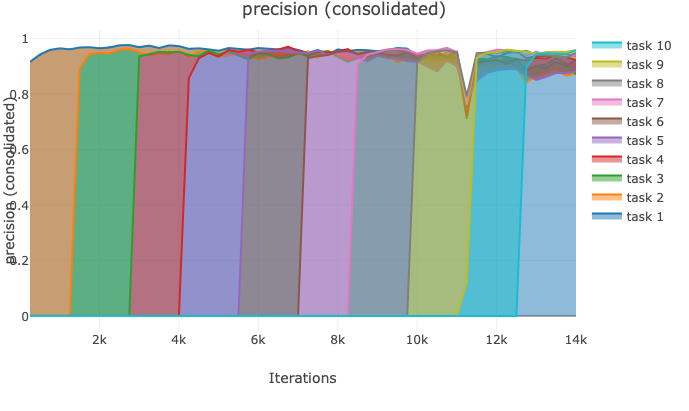

Start visdom server:
```
$ python -m visdom.server
```

Training without ewc:
```
$ python main.py
```

Training with original ewc:
```
$ python main.py --consolidate --lamda 40
```

Training with second derivative ewc:
```
$ python main.py --consolidate --secder_mode --abs_mode
```

Result:



No worse or even better than original ewc.

# pytorch-ewc
Unofficial PyTorch implementation of DeepMind's paper [Overcoming Catastrophic Forgetting, PNAS 2017](https://arxiv.org/abs/1612.00796).


## Results

Continual Learning **without EWC** (*left*) and **with EWC** (*right*).

 


## Installation
```
$ git clone https://github.com/kuc2477/pytorch-ewc && cd pytorch-ewc
$ pip install -r requirements.txt
```


## CLI
Implementation CLI is provided by `main.py`


#### Usage
```
$ ./main.py --help
$ usage: EWC PyTorch Implementation [-h] [--hidden-size HIDDEN_SIZE]
                                  [--hidden-layer-num HIDDEN_LAYER_NUM]
                                  [--hidden-dropout-prob HIDDEN_DROPOUT_PROB]
                                  [--input-dropout-prob INPUT_DROPOUT_PROB]
                                  [--task-number TASK_NUMBER]
                                  [--epochs-per-task EPOCHS_PER_TASK]
                                  [--lamda LAMDA] [--lr LR]
                                  [--weight-decay WEIGHT_DECAY]
                                  [--batch-size BATCH_SIZE]
                                  [--test-size TEST_SIZE]
                                  [--fisher-estimation-sample-size FISHER_ESTIMATION_SAMPLE_SIZE]
                                  [--random-seed RANDOM_SEED] [--no-gpus]
                                  [--eval-log-interval EVAL_LOG_INTERVAL]
                                  [--loss-log-interval LOSS_LOG_INTERVAL]
                                  [--consolidate]

optional arguments:
  -h, --help            show this help message and exit
  --hidden-size HIDDEN_SIZE
  --hidden-layer-num HIDDEN_LAYER_NUM
  --hidden-dropout-prob HIDDEN_DROPOUT_PROB
  --input-dropout-prob INPUT_DROPOUT_PROB
  --task-number TASK_NUMBER
  --epochs-per-task EPOCHS_PER_TASK
  --lamda LAMDA
  --lr LR
  --weight-decay WEIGHT_DECAY
  --batch-size BATCH_SIZE
  --test-size TEST_SIZE
  --fisher-estimation-sample-size FISHER_ESTIMATION_SAMPLE_SIZE
  --random-seed RANDOM_SEED
  --no-gpus
  --eval-log-interval EVAL_LOG_INTERVAL
  --loss-log-interval LOSS_LOG_INTERVAL
  --consolidate

```


#### Train
```
$ python -m visdom.server &
$ ./main.py               # Train the network without consolidation.
$ ./main.py --consolidate # Train the network with consolidation.
```


## Update Logs
- 2019.06.29
    - **Fixed a critical bug within `model.estimate_fisher()`**: Squared gradients of log-likelihood w.r.t. each layer were mean-reduced over all the dimensions. Now it correctly estimates the Fisher matrix by averaging only over the batch dimension
- 2019.03.22
    - **Fixed a critical bug within `model.estimate_fisher()`**: Fisher matrix were being estimated with squared expectation of gradient of log-likelihoods. Now it estimates the Fisher matrix with the expectation of squared gradient of log-likelihood.
    - Changed the default optimizer from Adam to SGD
    - Migrated the project to PyTorch 1.0.1 and visdom 0.1.8.8

## Reference
- [Overcoming Catastrophic Forgetting, PNAS 2017](https://arxiv.org/abs/1612.00796)

## Author
Ha Junsoo / [@kuc2477](https://github.com/kuc2477) / MIT License
